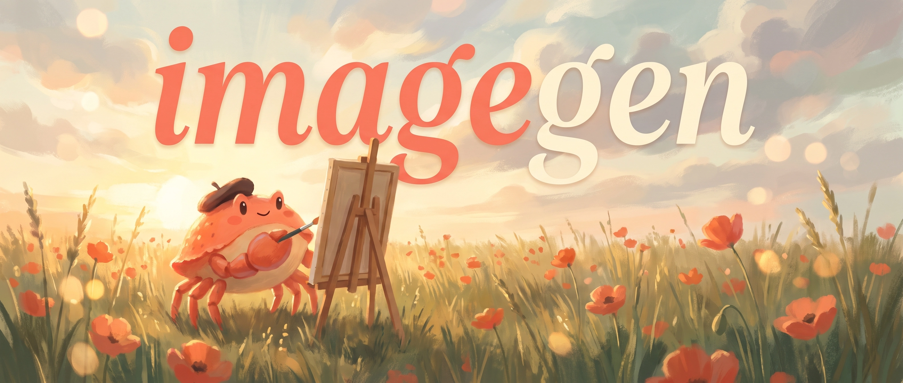

<p align="center">
  
</p>

# imagegen — image engine skill

A dead-simple image engine an AI agent can drive as a **skill**. One CLI in front of two
backends — OpenAI **gpt-image-2** / **gpt-image-1.5** and Google **gemini-3.1-flash-image**
("Nano Banana 2", default) with **gemini-3-pro-image** ("Nano Banana Pro") a flag away.
Model IDs and params verified against 2026 docs.

> **Agents:** read **[SKILL.md](SKILL.md)** — that's the canonical usage guide (registered as
> the `imagegen` skill). This README is the human setup + overview.

## Setup

```bash
pip install -r requirements.txt
cp .env.example .env        # add OPENAI_API_KEY + GOOGLE_API_KEY
```

The CLI loads keys from its own `.env`, so it runs correctly from any directory.

## Use

```bash
# single  (auto-routes: gemini for scenes, openai for icons/edits/transparent)
python3 imagegen.py "a ceramic coffee cup by a window, soft morning light, photoreal"
# -> {"ok": true, "provider": "gemini", "model": "gemini-3.1-flash-image", "images": ["outputs/..._0.webp"], ...}

# batch  (concurrent, monitored, manifest-logged)
python3 imagegen.py batch prompts.jsonl --workers 4

# cost: estimate before spending, then track running total
python3 imagegen.py batch prompts.jsonl --estimate     # -> projected cost, generates nothing
python3 imagegen.py cost                                # -> today / all-time / by model
```

`stdout` is always one JSON object; live progress goes to `stderr`. Full flag table, batch
file formats, engine-selection rules, and the anchor/consistency workflow are in
**[SKILL.md](SKILL.md)**.

## What it gives you

- **One command, JSON out** — trivial for an agent to call and parse.
- **Two engines, one signature** — `--provider auto|openai|gemini`; `auto` routes by intent. Gemini defaults to **Nano Banana 2** (`gemini-3.1-flash-image`); `--model pro` switches to Nano Banana Pro.
- **Batch + monitoring** — concurrent worker pool, live per-item progress, a `batch_*.json` run-manifest; one failed item never aborts the run.
- **Cost estimator + tracker** — `--estimate` projects spend before generating; every run reports `cost_usd`; spend is logged to `cost_ledger.jsonl` and summarized by `imagegen.py cost`.
- **Transparent backgrounds** — `--transparent` auto-routes to gpt-image-1.5 (gpt-image-2 can't do it).
- **Provenance, always** — every image embeds its prompt in EXIF + writes a sidecar `.json`. Nothing about how an image was made is ever lost.

## Registering as a skill

A symlink already points the live skill at this repo:

```
~/.claude/skills/imagegen/SKILL.md -> ./SKILL.md
```

So editing `SKILL.md` here updates the skill directly — single source of truth, no drift.

## Files

| file | purpose |
|------|---------|
| `imagegen.py` | the engine (CLI: `single` + `batch`) |
| `SKILL.md` | canonical agent-facing skill guide |
| `AGENTS.md` | pointer to SKILL.md + notes on the optional async Batch API |
| `requirements.txt` | `openai`, `google-genai`, `Pillow`, `python-dotenv` |
| `.env` / `.env.example` | API keys (gitignored) |
| `outputs/` | generated images + sidecar JSON + batch manifests (gitignored) |
